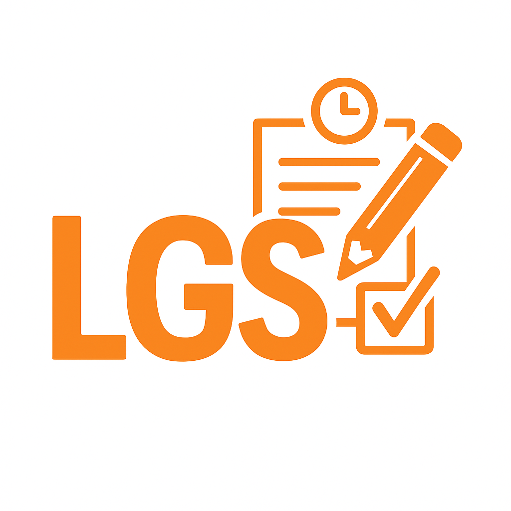
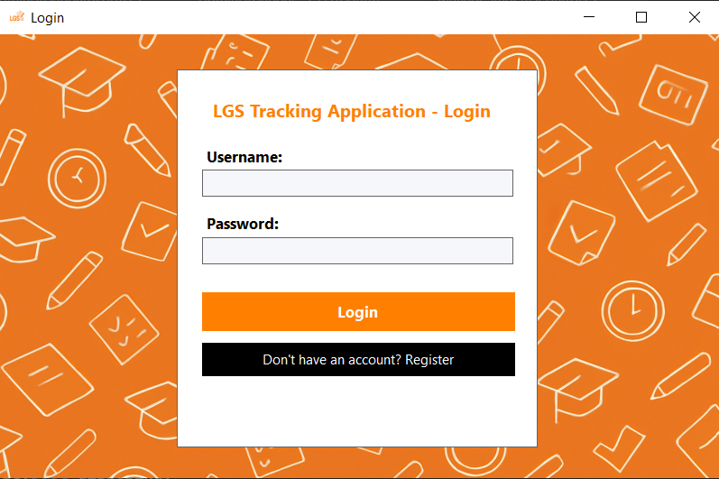
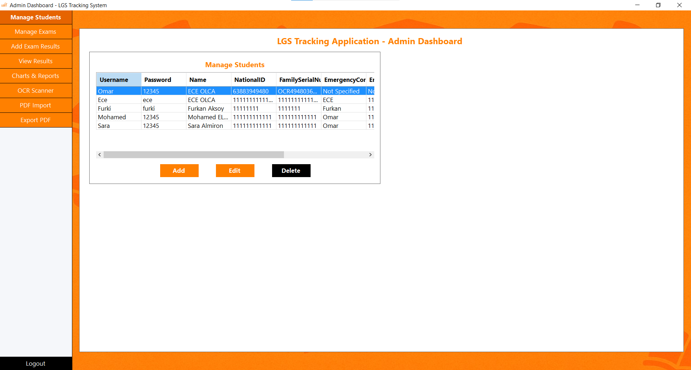
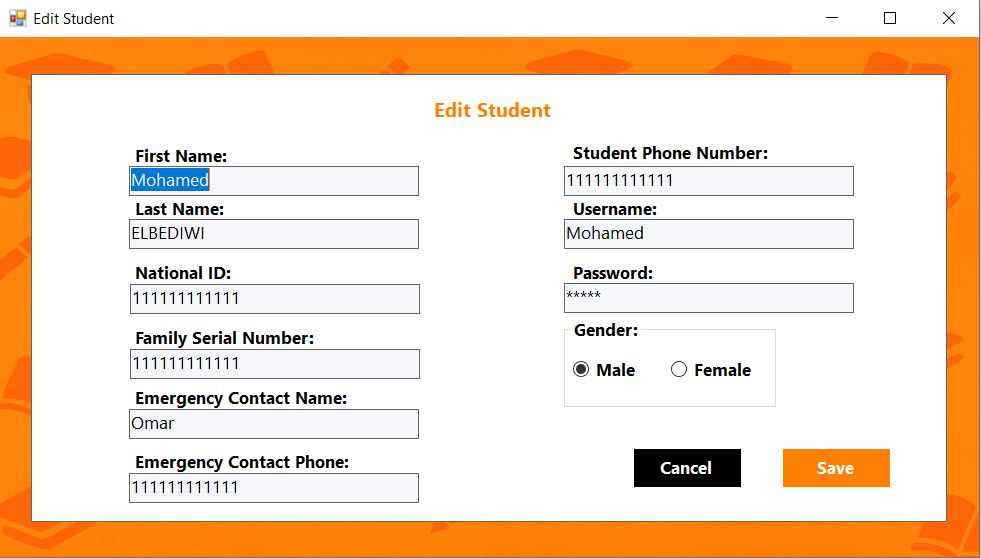
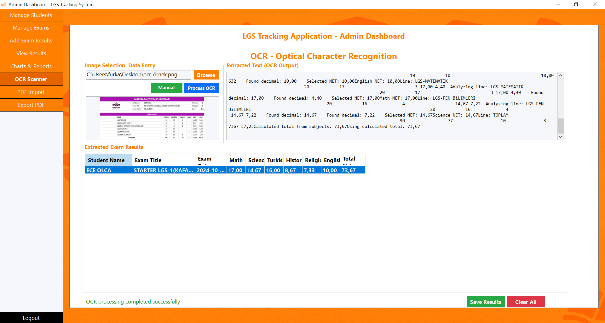
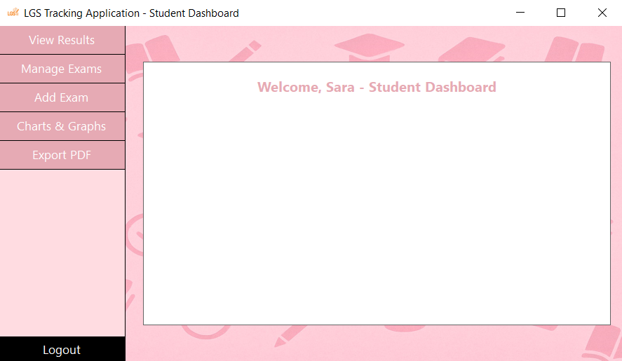
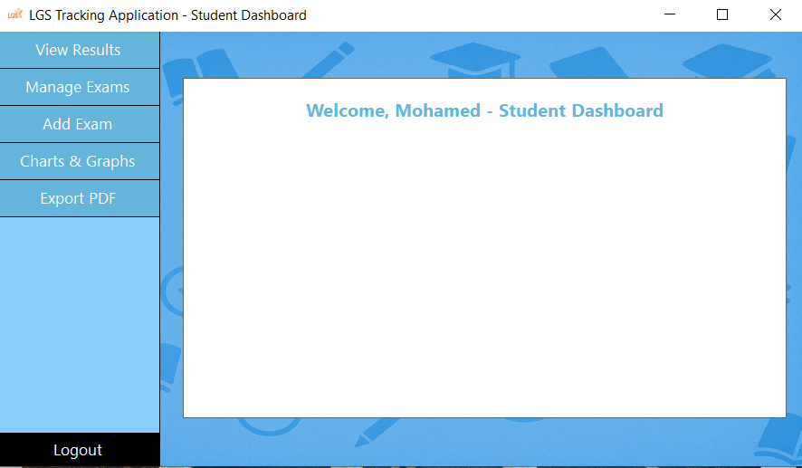
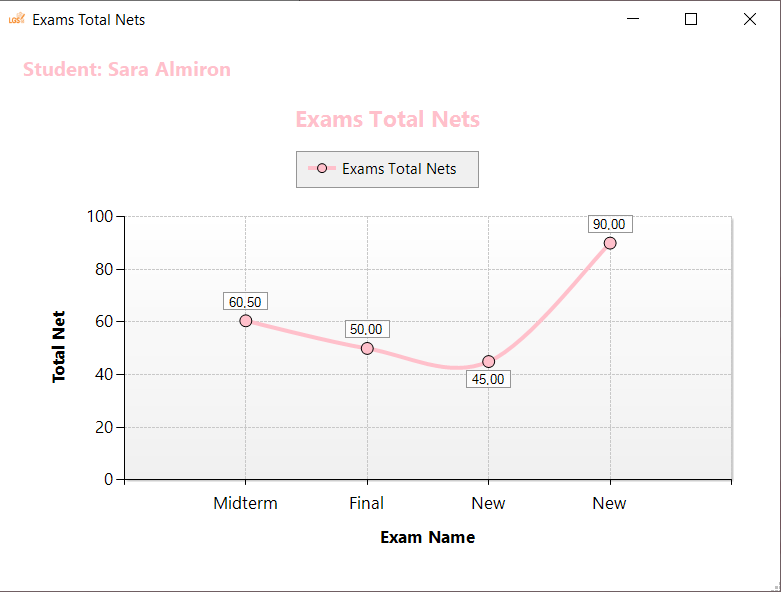
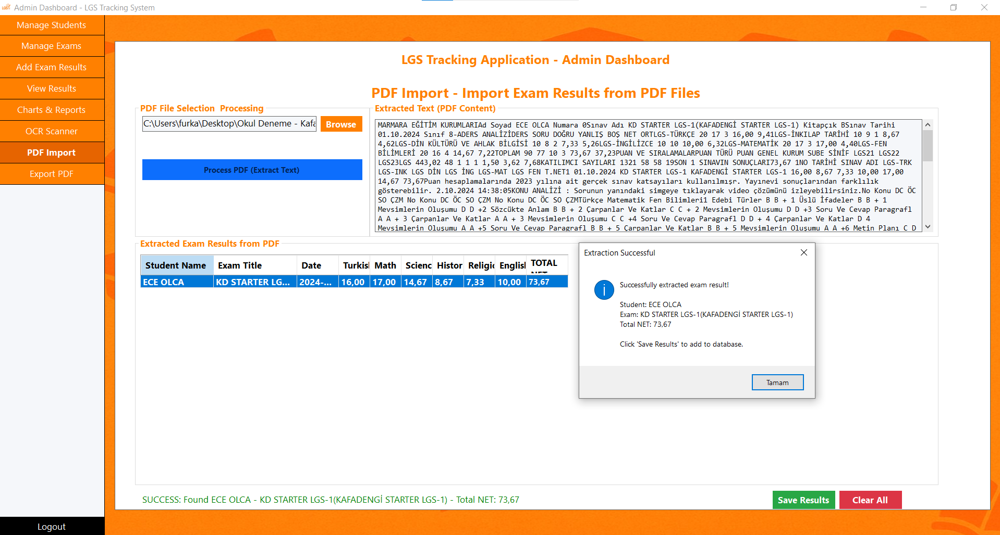
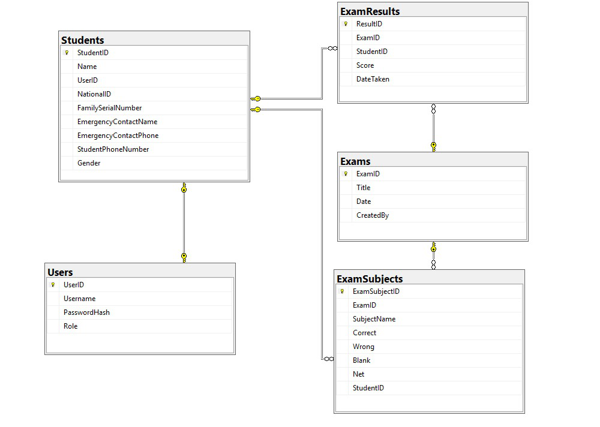

# LGS Tracking Application



[](https://dotnet.microsoft.com/download/dotnet-framework)
[](https://www.microsoft.com/sql-server)
[](https://docs.microsoft.com/dotnet/desktop/winforms)
[](LICENSE)

A comprehensive desktop application for tracking and analyzing High School Entrance Exam (LGS) practice test performance in Turkey. This multi-user system provides detailed analytics, automated data entry, and performance visualization for both students and administrators.

## 📋 Table of Contents

- [Features](#features)
- [Technologies Used](#technologies-used)
- [System Requirements](#system-requirements)
- [Installation](#installation)
- [Usage](#usage)
- [Screenshots](#screenshots)
- [System Architecture](#system-architecture)
- [Database Design](#database-design)
- [Contributing](#contributing)
- [Academic Publications](#academic-publications)
- [License](#license)
- [Contact](#contact)

## ✨ Features

### 👨‍💼 Administrator Features
- **Student Management**: Complete CRUD operations for student records
- **Multi-Modal Data Entry**: 
  - Manual exam result entry
  - PDF document import with automatic parsing
  - OCR (Optical Character Recognition) for scanned forms
- **Advanced Analytics**: Comprehensive performance reports and trend analysis
- **Bulk Operations**: Efficient handling of multiple student records
- **PDF Report Generation**: Professional formatted reports with charts and statistics

### 👨‍🎓 Student Features
- **Personal Dashboard**: Gender-based theming (blue for male, pink for female)
- **Performance Tracking**: View individual exam history and progress
- **Self-Service Data Entry**: Add personal practice test results
- **Visual Analytics**: Interactive charts and graphs showing performance trends
- **PDF Export**: Generate and download personal performance reports
- **Subject-wise Analysis**: Detailed breakdown by subject areas

### 🔧 Technical Features
- **Role-based Access Control**: Secure authentication and authorization
- **Real-time Data Validation**: Ensures data integrity and accuracy
- **Responsive Interface**: Optimized for different screen resolutions
- **Turkish Language Support**: Full localization for Turkish users
- **Automated Calculations**: LGS scoring formula implementation

## 🛠 Technologies Used

| Technology | Purpose |
|------------|---------|
| **C# .NET Framework 4.7.2** | Core application development |
| **Windows Forms** | Desktop user interface |
| **Microsoft SQL Server 2022** | Database management |
| **Entity Framework 6.0** | Object-relational mapping |
| **iTextSharp** | PDF processing and generation |
| **Tesseract OCR** | Optical character recognition |
| **Chart Controls** | Data visualization |
| **Crystal Reports** | Advanced reporting |

## 💻 System Requirements

- **Operating System**: Windows 10 or higher
- **Framework**: .NET Framework 4.7.2 or higher
- **Database**: SQL Server 2019 or higher
- **RAM**: Minimum 4GB, Recommended 8GB
- **Storage**: 500MB available space
- **Display**: 1024x768 resolution minimum

## 🚀 Installation

### Prerequisites
1. Install [.NET Framework 4.7.2](https://dotnet.microsoft.com/download/dotnet-framework/net472)
2. Install [SQL Server 2019+](https://www.microsoft.com/sql-server/sql-server-downloads)
3. Install [Visual Studio 2019+](https://visualstudio.microsoft.com/) (for development)

### Steps
1. **Clone the repository**
   ```bash
   git clone https://github.com/yourusername/lgs-tracking-application.git
   cd lgs-tracking-application
   ```

2. **Database Setup**
   ```sql
   -- Execute the database creation script
   -- Located in: /Database/LGSTrackingDB.sql
   ```

3. **Configure Connection String**
   ```xml
   <!-- Update app.config with your SQL Server instance -->
   <connectionStrings>
     <add name="LGSConnection" 
          connectionString="Server=YOUR_SERVER;Database=LGSTracking;Integrated Security=true;" />
   </connectionStrings>
   ```

4. **Build and Run**
   ```bash
   # Open in Visual Studio and build solution
   # Or use command line:
   msbuild LGSApp.sln /p:Configuration=Release
   ```

## 📖 Usage

### First Time Setup
1. **Admin Login**: Use default credentials (admin/admin123)
2. **Add Students**: Navigate to Student Management → Add Student
3. **Create Exams**: Set up exam templates in Exam Management
4. **Import Data**: Use PDF import or OCR features for bulk data entry

### Daily Operations
1. **For Administrators**:
   - Monitor student performance through analytics dashboard
   - Generate comparative reports across student groups
   - Process exam results using automated tools

2. **For Students**:
   - View personal performance trends
   - Add practice test results
   - Generate progress reports for parents/tutors

## 📷 Screenshots

### Login Interface


### Administrator Dashboard


### Student Management


### OCR Processing


### Student Dashboard (Female Theme)


### Student Dashboard (Male Theme)


### Performance Analytics


### PDF Report Generation


## 🏗 System Architecture

The application follows a three-tier architecture pattern:

```
┌─────────────────┐    ┌─────────────────┐    ┌─────────────────┐
│  Presentation   │    │  Business Logic │    │   Data Access   │
│     Layer       │◄──►│     Layer       │◄──►│     Layer       │
│  (Windows Forms)│    │   (Services)    │    │ (Entity Framework)│
└─────────────────┘    └─────────────────┘    └─────────────────┘
```

### Key Components
- **Authentication Service**: Handles user login and role management
- **OCR Engine**: Processes scanned documents using Tesseract
- **PDF Processor**: Imports and exports PDF documents
- **Chart Generator**: Creates performance visualizations
- **Report Builder**: Generates comprehensive PDF reports

## 🗄 Database Design

The system uses a normalized relational database structure:



### Core Tables
- **Users**: Authentication and role management
- **Students**: Student profile information
- **Exams**: Exam metadata and configuration
- **ExamResults**: Aggregate exam scores
- **ExamSubjects**: Subject-wise performance details

## 🤝 Contributing

We welcome contributions to improve the LGS Tracking Application!

### Development Setup
1. Fork the repository
2. Create a feature branch (`git checkout -b feature/AmazingFeature`)
3. Commit your changes (`git commit -m 'Add some AmazingFeature'`)
4. Push to the branch (`git push origin feature/AmazingFeature`)
5. Open a Pull Request

### Coding Standards
- Follow C# naming conventions
- Add XML documentation for public methods
- Include unit tests for new features
- Ensure database changes are properly scripted

## 📚 Academic Publications

This project has been presented at academic conferences:

1. **4th Kocatepe Engineering Sciences Student Symposium** (2025)
   - Paper: "LGS Takip Uygulaması: Sınav Performansı İzleme ve Değerlendirme Sistemi"
   - Authors: Furkan Aksoy, Emre Atlıer Olca
   - Institution: Maltepe University

2. **MÜBAK 2025 - Engineering Sciences and Research Congress**
   - Presentation on educational technology applications
   - Focus on student performance tracking systems

## 📄 License

This project is licensed under the MIT License - see the [LICENSE](LICENSE) file for details.

## 👥 Team

| Role | Name | Contact |
|------|------|---------|
| **Lead Developer** | Furkan Aksoy | 210706029@st.maltepe.edu.tr |
| **Project Supervisor** | Dr. Emre Atlıer Olca | emre.olca@maltepe.edu.tr |
| **Contributors** | Emre Sarı, Omar Elbediwi | - |

## 🏫 Institution

**Maltepe University**  
Faculty of Engineering and Natural Sciences  
Software Engineering Department  
Istanbul, Turkey

## 📞 Contact

For questions, suggestions, or collaboration opportunities:

- **Email**: 210706029@st.maltepe.edu.tr
- **Project Repository**: [GitHub](https://github.com/yourusername/lgs-tracking-application)
- **Institution**: [Maltepe University](https://www.maltepe.edu.tr)

## 🙏 Acknowledgments

- Dr. Emre Atlıer Olca for project supervision and guidance
- Maltepe University Faculty of Engineering and Natural Sciences
- All contributors and testers who helped improve the application


---

*This project was developed as part of the SE 374 Visual Programming course at Maltepe University, demonstrating practical applications of desktop development technologies in educational contexts.*
